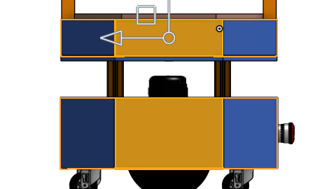
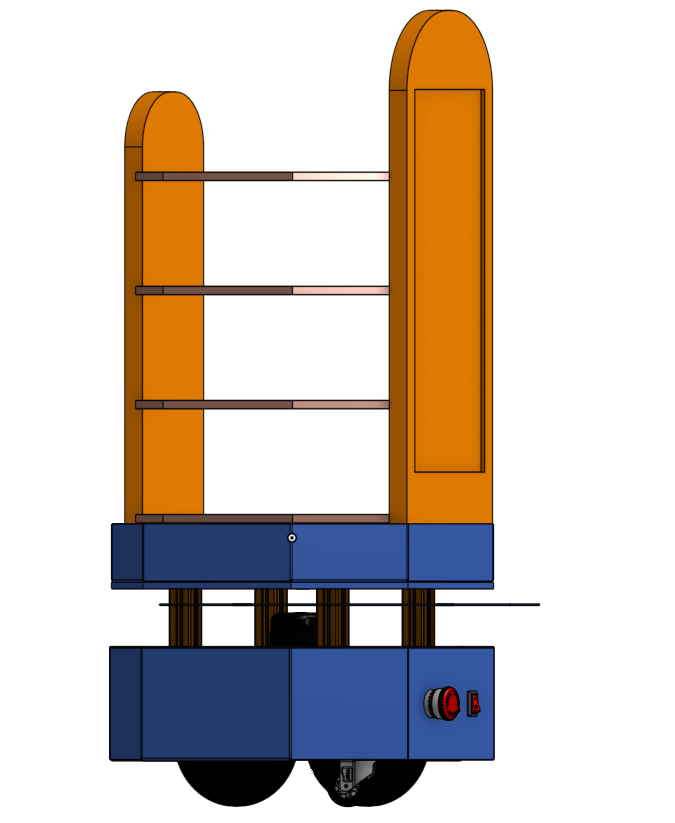
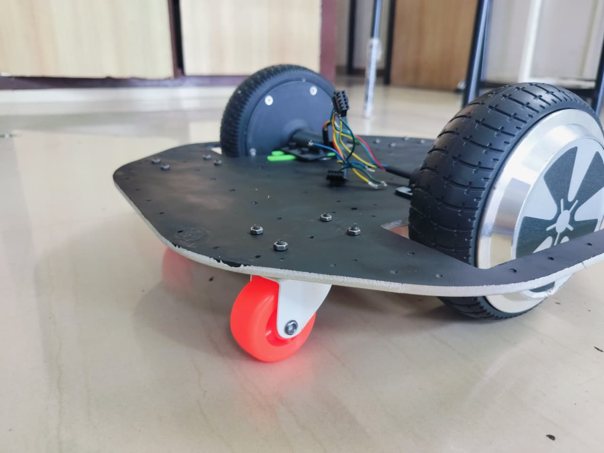
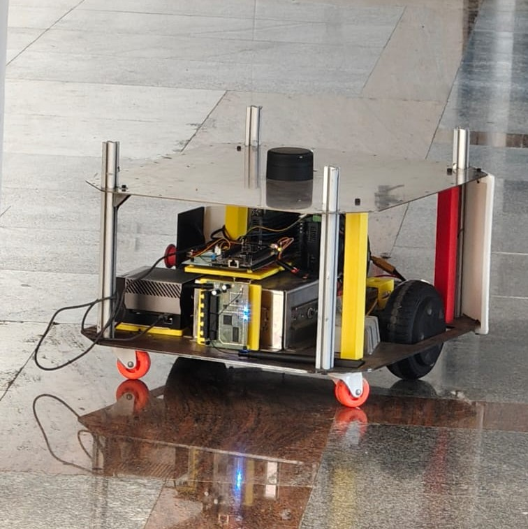
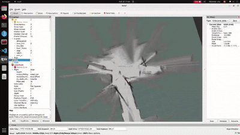
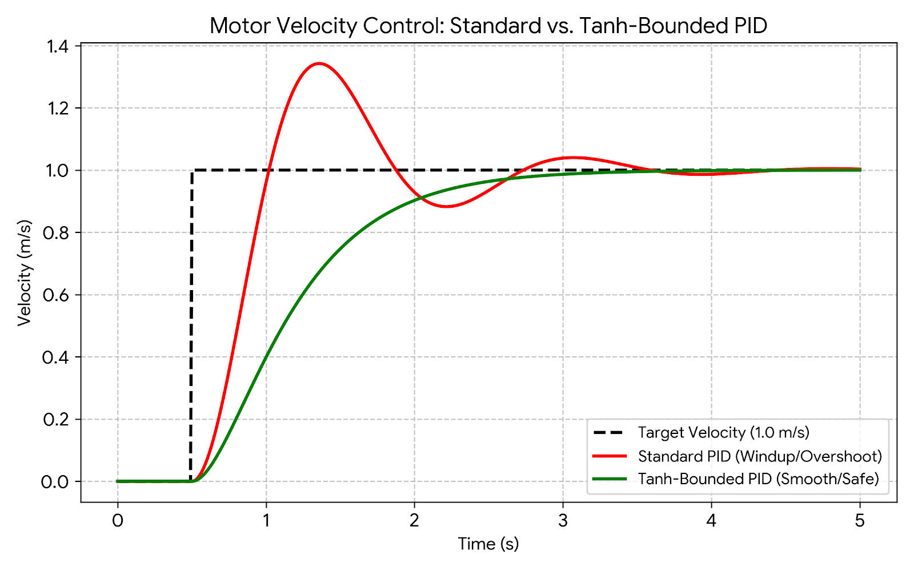
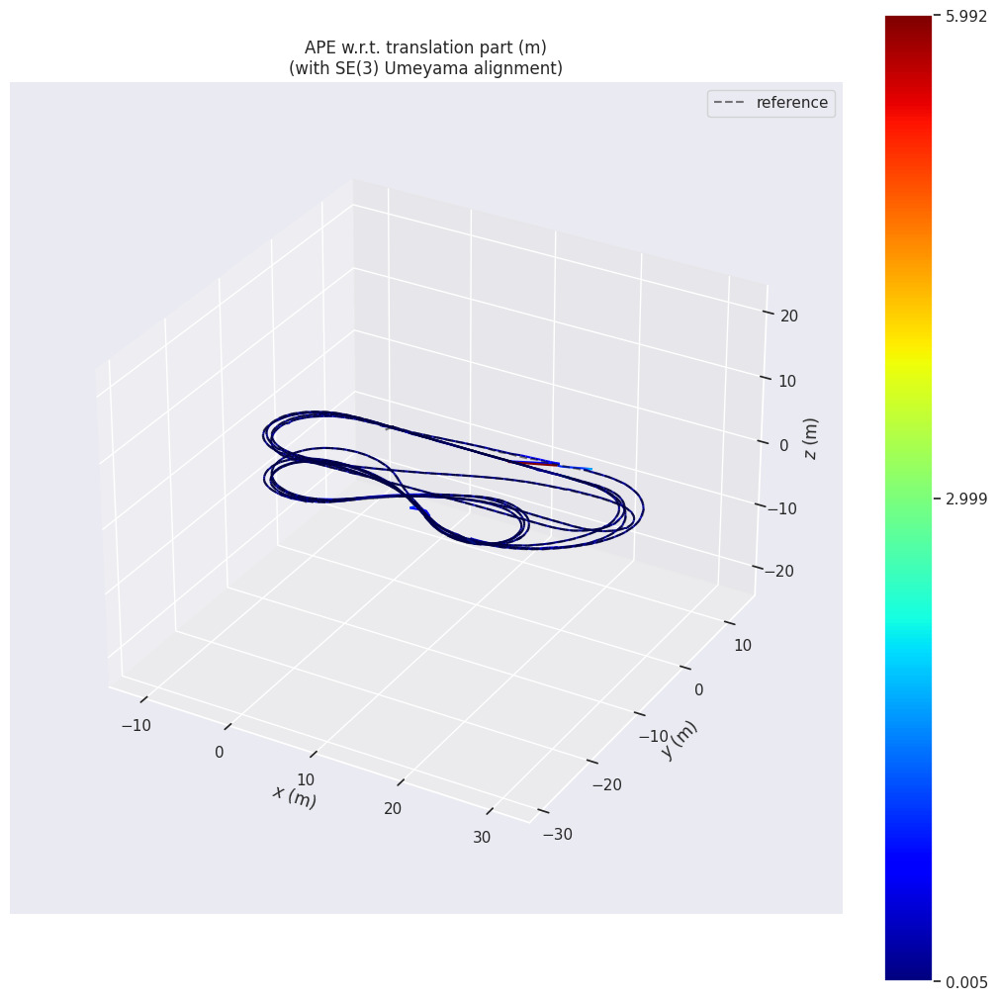
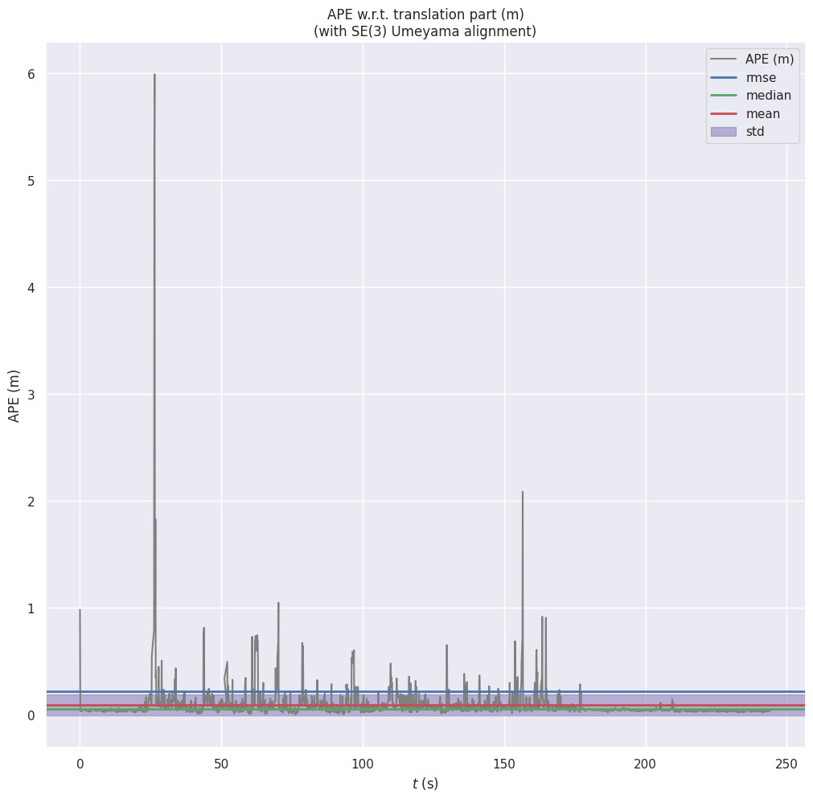
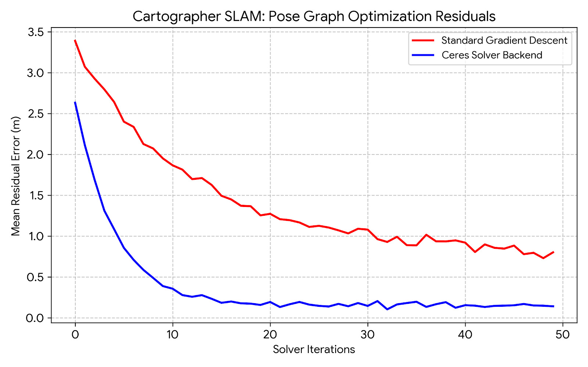
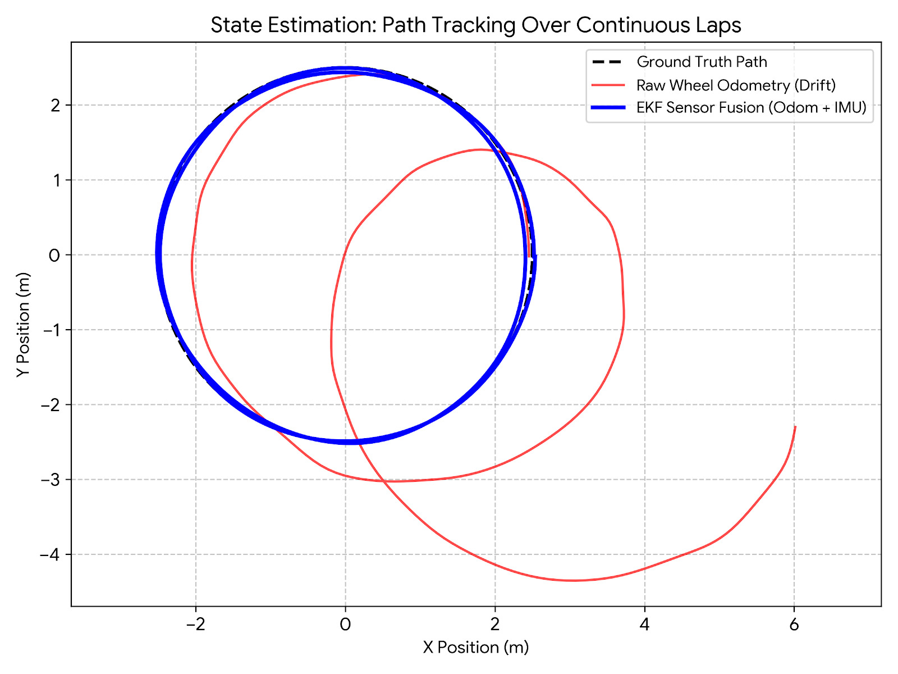

# MoVIER

This repository contains the software stack for **MoVIER** **R1** and **R2** base module capable of autonomous mapping and navigation. The project implements sensor fusion, motor control, and SLAM using extended Kalman filter.

---

## 📖 Table of Contents
* [Project Overview](#-project-overview)
* [System Architecture](#-system-architecture)
* [Design](#-design)
* [SLAM Testing](#-slam-testing)
* [Benchmarks](#-benchmarks)
* [The Team](#-the-team)

---

## 🚀 Project Overview
The robot utilizes a two-wheeled differential steering system with 2 passive casters for stability. By processing data from an onboard LIDAR, IMU and wheel encoders, the robot constructs a real-time map of its environment while simultaneously tracking its own position.
* **Differential Drive Control:** Precise velocity commands ($v$, $\omega$) translated to left/right motor PWM.
* **SLAM Integration:** Compatible with Cartographer for high-accuracy 2D mapping.
* **Navigation Stack:** Autonomous path planning and obstacle avoidance via the ROS Navigation Stack (Nav2).
* **Simulation Support:** Includes Gazebo and RViz configurations for testing in virtual environments.

---

## 🏗 System Architecture

* **Middleware:** ROS2 Humble
* **SLAM:** Cartographer
* **Navigation:** Nav2 (Navigation 2 Stack)
* **Simulation:** Gazebo & RViz2
* **Sensors:** YD G2 Lidar, BNO085 IMU, Wheel encoders

---

## 🤖 Design

### CAD Models

<table border="0">
  <tr>
    <td align="center">
      
       
      <b>MoVIER Base Module</b>
    </td>
    <td align="center">
      
       
      <b>MoVIER R1 Bot</b>
    </td>
  </tr>
</table>

### Prototypes

* **ProtoV1**

* **ProtoV2**

---

## 🧭 SLAM Testing

<table border="0">
  <tr>
    <td align="center">
      
       
      <b>Mapping</b>
    </td>
    <td align="center">
      
       
      <b>Localization</b>
    </td>
  </tr>
</table>

---

## 🛠 Benchmarks

* **PID Algorithms Comparison**

* **Absolute Position Error**

  
  

* **Cartographer Algorithms Comparison**

* **Path Tracking Over Continuous Laps**

---

## 👥 The Team
Developed with passion for the **India Innovates 2026** National Innovation Summit at Bharat Mandapam, New Delhi.

* **Divyanshu Pandey**
    * *Mail:* [Link](mailto:dnokia3310@gmail.com)
    * *LinkedIn:* [Link](https://www.linkedin.com/in/divyanshu006/)
* **Rahul Rajak**
    * *Mail:* [Link](rahulrajak5629@gmail.com)
    * *LinkedIn:* [Link](https://www.linkedin.com/in/rahul-rajak-964638261/)
* **Shubh Khandelwal**
    * *Mail:* [Link](mailto:shubh4664@gmail.com)
    * *LinkedIn:* [Link](https://www.linkedin.com/in/shubh--khandelwal/)
* **Ayush Kumar**
    * *Mail:* [Link](mailto:ayushle6@gmail.com)
    * *LinkedIn:* [Link](https://www.linkedin.com/in/ayush-kumar-a44632283/)
* **Raj Rajeshwar Gupta**
    * *Mail:* [Link](mailto:rajrajeshwargupta745@gmail.com)
    * *LinkedIn:* [Link](https://www.linkedin.com/in/raj-rajeshwer-gupta-15511a220/)